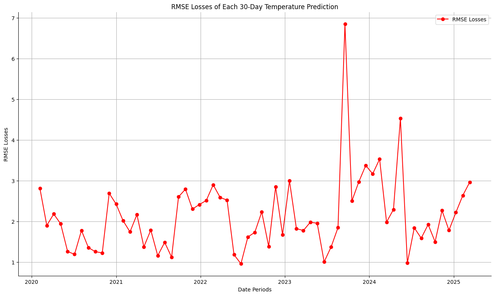
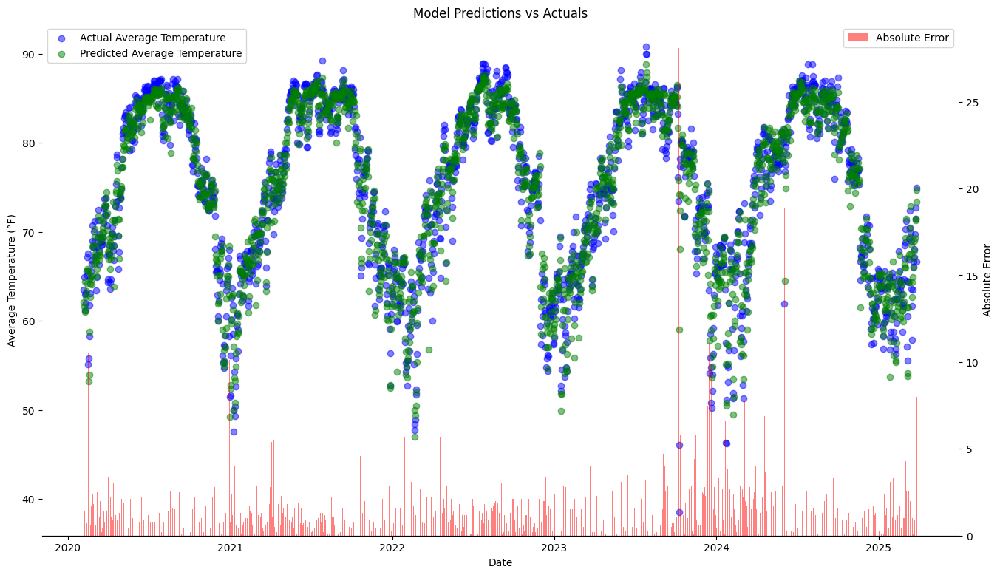

# Forecast Macao Temperature in 30 Days

## Code File Structure

1. **Catch_data.ipynb**
   - Crawls historical weather data from Weather Underground (2001.01.01 - 2025.03.28)
   - Saves the collected data to a CSV file

2. **Process_data.ipynb**
   - Performs the following data processing steps:
     - Sets the index as datetime format
     - Handles missing/abnormal values for various features
   - Feature engineering:
     - Add features with moving average data and diff data

3. **Model_data.ipynb**
   - Implements progressive window training with GRU architecture:
     - **Initial Split**:
       - Train: All data until December 31, 2019
       - Test: January 1-30, 2020 (30-day window)
     - **Rolling Training Process**:
       1. Train GRU model on current training set
       2. Evaluate on next 30-day test window
       3. Incorporate test window into training data
       4. Slide window forward and repeat
     - **GRU Configuration**:
       - 2 GRU layers (50 units, 20 units)
       - Dropout regularization (0.2)
       - Optimizer: Adam(learning_rate=0.001)
       - Early stopping: patience = 3
       - Batch size, Epochs: 32, 20
       - Forecast horizon: 30 days
     - **Test**:
       - Evaluate the performance of the model by sum of RMSE
   - Feature selecting:
     - Delete feature one by one, and then throw the other features into the model
     - Get the new model performance, and find the performance declines
     - Delete all the features that make the model performance worse
     - Throw all the useful feature into the model, and then view the improved performance
     - The whole process takes more than 6 hours with kaggle GPU P100 accelerator
   - Model performance
     - **Baseline**:
       - RMSE-sum: 134.6954
       - RMSE-mean: 2.138
       - RMSE-drop-outliers: 2.0216
     - **Updated**:
       - RMSE-sum: 136.2702
       - RMSE-mean: 2.163
       - RMSE-drop-outliers: 2.0349
4. **Visualize_data.ipynb**:
   - Plot the test losses with line chart
   - Plot the actual temp and predicted temp with scatter
   - Plot the absolute error of actual and predicted temp with bar chart

## Data File Details

1. **weather_data.csv**: the raw data of Macao weather conditions between 2001.01.01 and 2025.03.28
2. **weather_data_cleaned.csv**: cleaned data which can be directly thrown into the model
3. **feature_importance.csv**: how much declines of the model performance when droping each feature
4. **data_test_losses.csv**: losses of each test (all features in the model)
5. **data_test_result.csv**: the actual and predicted values of macao average temperatures from 2020 to 2025

## Data Processing Details

### Temperature Handling
- Feature: `Temp_Min`
  - Replaces zero values with: `(2 × Temp_Avg - Temp_Max)`
  - Caps minimum value at 30 (replaces values <30 with 30)

### Dew Point Handling
- Feature: `Dew_Min`
  - Replaces zero values with: `(2 × Dew_Avg - Dew_Max)`
  - Caps minimum value at 10 (replaces values <10 with 10)

### Humidity Handling
- Feature: `Humidity_Min`
  - Replaces zero values with: `(2 × Humidity_Avg - Humidity_Max)`
  - Caps minimum value at 20 (replaces values <20 with 20)

### Wind Handling
- Feature: `Wind_Max`
  - Caps maximum value at 50 (converts values ≥50 to 50)

### Pressure Handling
- Feature: `Pressure_Avg`
  - Sets minimum value at 27.3 (converts values <27.3 to 27.3)
- Feature: `Pressure_Min`
  - Replaces zero values with the average of the other pressure measurements
## Feature Engineering

The dataset was enhanced with rolling statistics and differential features across all weather metrics:

### Temperature Features
- **Rolling averages** (3-day and 7-day windows):
  - `Temp_Max_3`, `Temp_Max_7`
  - `Temp_Min_3`, `Temp_Min_7`
  - `Temp_Avg_3`, `Temp_Avg_7`
- **Differential features**:
  - `Temp_Diff_Max_Avg`: (Max - Avg)
  - `Temp_Diff_Min_Avg`: (Min - Avg)
  - `Temp_Diff_Max_Min`: (Max - Min)

### Dew Point Features
- **Rolling averages** (3-day and 7-day windows):
  - `Dew_Max_3`, `Dew_Max_7`
  - `Dew_Min_3`, `Dew_Min_7`
  - `Dew_Avg_3`, `Dew_Avg_7`
- **Differential features**:
  - `Dew_Diff_Max_Avg`: (Max - Avg)
  - `Dew_Diff_Min_Avg`: (Min - Avg)
  - `Dew_Diff_Max_Min`: (Max - Min)

### Humidity Features
- **Rolling averages** (3-day and 7-day windows):
  - `Humidity_Max_3`, `Humidity_Max_7`
  - `Humidity_Min_3`, `Humidity_Min_7`
  - `Humidity_Avg_3`, `Humidity_Avg_7`
- **Differential features**:
  - `Humidity_Diff_Max_Avg`: (Max - Avg)
  - `Humidity_Diff_Min_Avg`: (Min - Avg)
  - `Humidity_Diff_Max_Min`: (Max - Min)

### Wind Features
- **Rolling averages** (3-day and 7-day windows):
  - `Wind_Max_3`, `Wind_Max_7`
  - `Wind_Min_3`, `Wind_Min_7`
  - `Wind_Avg_3`, `Wind_Avg_7`
- **Differential features**:
  - `Wind_Diff_Max_Avg`: (Max - Avg)
  - `Wind_Diff_Min_Avg`: (Min - Avg)
  - `Wind_Diff_Max_Min`: (Max - Min)

### Pressure Features
- **Rolling averages** (3-day and 7-day windows):
  - `Pressure_Max_3`, `Pressure_Max_7`
  - `Pressure_Min_3`, `Pressure_Min_7`
  - `Pressure_Avg_3`, `Pressure_Avg_7`
- **Differential features**:
  - `Pressure_Diff_Max_Avg`: (Max - Avg)
  - `Pressure_Diff_Min_Avg`: (Min - Avg)
  - `Pressure_Diff_Max_Min`: (Max - Min)

## Model Performance

